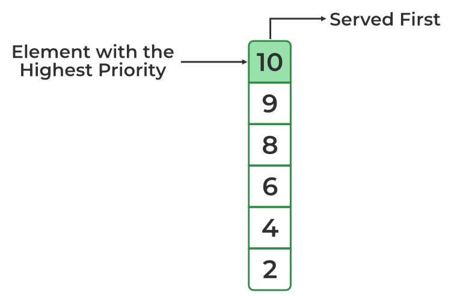
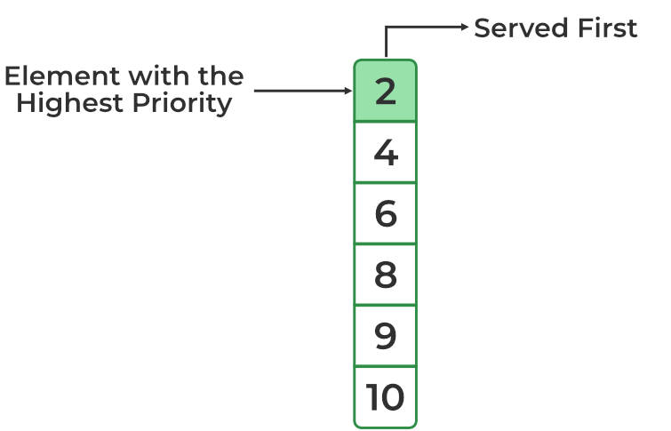
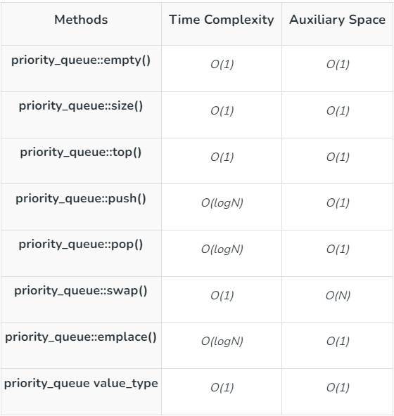

<center> <font face=red size=5> C++ 优先队列 priority_queue </font> </center>

+++
title = "C++ 优先队列 priority_queue"
date = 2026-04-18
draft = false
categories = ["C++"]
tags = ["priority_queue", "STL", "数据结构"]
+++

&emsp; 本文介绍一下 C++ 标准库中的容器适配器 std::priority_queue。 正如所言, 它不是标准容器, 而是在内部封装了一个标准库容器, 
那么它到底封装的哪一个标准容器呢？ 阅读完全文应该能猜中, 哈哈哈。

reference:
 [https://www.geeksforgeeks.org/priority-queue-in-cpp-stl/]( https://www.geeksforgeeks.org/priority-queue-in-cpp-stl/)
 [https://stackoverflow.com/questions/19467485/how-to-remove-element-not-at-top-from-priority-queue]( https://stackoverflow.com/questions/19467485/how-to-remove-element-not-at-top-from-priority-queue)

		   

#### 一、相逢何必曾相识
 &emsp; 我在刚开始学 C++ 的时候就在网上见过这个优先队列, 当然啦, 只是犹如走马观花一样的看了一下。后续在工作中也没有使用过, 所以就渐行渐远了。最近在星球上看到球主说如何删除  std::priority_queue 的元素, 于是好奇的搜索了一下。发现它还是很有用的, 那就是能快速获取元素集合中的最大或者最小的元素, 时间复杂度是 O(1).
 
 
#### 二、相std::priority_queue 用法
##### 2.1 std::priority_queue 主要用途
  &emsp; std::priority_queue 默认是将最大的元素放在队首, 其余元素的序列未指定。所以, top()成员函数获取最大或者最小元素的时间复杂度是 O(1)。示例代码如下:
 
```javascript 
#include <iostream>
#include <queue>
using namespace std;
 
int main()
{
    vector<int> vector_range = { 10, 2, 4, 8, 6, 9 };
    
    priority_queue<int> pq( vector_range.begin(), vector_range.end() );
    
    cout << "Priority Queue: ";
    while (!pq.empty()) {
        cout << pq.top() << ' ';
        pq.pop();
    }

    return 0;
}
``` 
输出如下：

>Priority Queue: 10 9 8 6 4 2  
 
如果需要将最小元素放在队首, 直接在 std::priority_queue 的模版参数里面指定比较器即可, 如下所示:
```javascript 
#include <iostream>
#include <queue>
using namespace std;
 
int main()
{
    vector<int> vector_range = { 10, 2, 4, 8, 6, 9 };
    
    priority_queue<int, vector<int>, std::greater<> > pq( vector_range.begin(), vector_range.end() );
    
    cout << "Priority Queue: ";
    while (!pq.empty()) {
        cout << pq.top() << ' ';
        pq.pop();
    }

    return 0;
} 
``` 
输出如下：
> Priority Queue: 2 4 6 8 9 10 
> 
两种情况下内存布局分别如下图所示:
 
 

##### 2.2 std::priority_queue 的成员函数
&emsp; std::priority_queue 相关成员函数使用时的时间复杂度和空间复杂度：
 

#### 二、 std::priority_queue 删除元素
 &emsp;如上图所示, std::priority_queue 没有删除元素的方法, 假如要清理一个 std::priority_queue 内的所有元素, 倒是可以定义一个空的 std::priority_queue, 然后使用 swap 成员方法与之进行交换。那么想删除一个元素该如何操作, 参考文章二中的 stackoverflow 提供了答案, 那就是自定义一个 priority_queue。std::priority_queue 是一个容器适配器, 内部组合了一个标准容器, 这个标准容器和比较器的访问权限都是  protected 的,  所以 std::priority_queue 的
 派生类可以访问到两者, 所以答案也就呼之欲出了。示例如下:
 ```javascript 
 template<typename T>
class custom_priority_queue : public std::priority_queue<T, std::vector<T>>
{
  public:

      bool remove(const T& value) {
          auto it = std::find(this->c.begin(), this->c.end(), value);
       
          if (it == this->c.end()) {
              return false;
          }
          if (it == this->c.begin()) {
              // deque the top element
              this->pop();
          }    
          else {
              // remove element and re-heap
              this->c.erase(it);
              std::make_heap(this->c.begin(), this->c.end(), this->comp);
         }
         return true;
     }
};

int main()
{
   custom_priority_queue<int> queue;

   queue.push(10);
   queue.push(2);
   queue.push(4);
   queue.push(6);
   queue.push(3);

   queue.remove(3);
   
   std::cout<<" after erase:";
   while (!queue.empty())
   {
      std::cout << queue.top() << ", ";
      queue.pop();
   }

 }
 ```
输出如下:
>after erase:10, 6, 4, 2, 
 
#### 三 总结 
 &emsp;从示例中可以看出, std::priority_queue 的核心是 std::make_heap。std::make_heap 算法是将序列容器构建在一个二叉树上, 根上的元素是最值, 最大还是最小根据提供的比较器而定。std::make_heap 只支持随机访问的迭代器, 标准库容器里面属于随机访问迭代器的标准容器只有std::array 和 std::vector。 考虑到 std::priority_queue 支持自由地插入元素, 所以 std::vector 合适。要用 std::array 的话, 假如超过容量以后就需要额外移动处理。
 查阅 cppreference.com 果然是 std::vector。
 
 
 