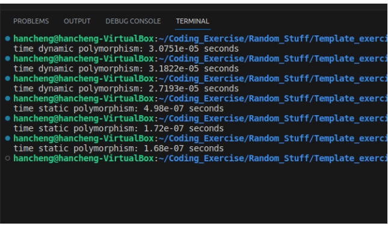

+++
title = "CRTP:奇异递归模板实践"
date = 2026-04-18
draft = false
categories = ["C++"]
tags = ["设计模式", "CRTP"]
+++

&emsp;我第一次听到到奇异递归模板这个C++习语, 还是在博览李键忠老师的C++骨干训练营课堂上, 当时是在讲标准库 shared_ptr 智能指针的 enable_shared_from_this 原理, 在我的这篇文章中有提及 [智能指针注意事项]( https://blog.csdn.net/PX1525813502/article/details/132797188?spm=1001.2014.3001.5501)

reference: [C++ Static Polymorphism Using CRTP: A Step-by-Step Tutorial](https://www.linkedin.com/pulse/c-static-polymorphism-using-crtp-step-by-step-tutorial-hancheng-dong/) 


#### 一、运行时多态
&emsp; 为了介绍 CRTP, 我们先来看看运行时的多态。这是目前大家都非常熟悉的, 我自己在工作中也是大量使用。

```javascript 
class IBase
{
public:
    virtual void impl() = 0;
    virtual ~IBase() = default;
};

class Derived : public IBase
{
public:
    void impl() override 
    {
        //do something
    }
};

```
&emsp; 这种接口继承的类层次结构使用公共继承, 它把用户和实现分开, 允许派生类增加或者改变基类的功能而且不影响基类模块,  确保在运行时根据实际指向的派生类实例, 调用正确的方案, 很好的实现了两个模块解耦。可扩展, 容易维护, 简直相当棒。 

与此同时, 它有两个特点: 
① 引入了 vitual 关键字, 编译器在编译的时候会在类的内部构建一个虚函数表, 需要额外的内存。
② 用户模块在运行时使用接口类指针调用函数时, 因为不知道具体是哪个实例, 所以需要先查询虚函数表, 这个查虚函数表的过程会降低性能。

所以, 有没有办法能避开运行时的查表过程, 将多态在编译时就确定，在保持接口实现分离的情况下提高效率。这就是 CRTP 的作用。

#### 二、使用 CRTP 的静多态
##### 2.1、CRTP 定义

&emsp; 为了能编译器就确定具体调用的函数, 所以要给予编译器足够的信息。代码如下:
```javascript 
template <typename T>
class IBase
{
public:
    void interface()
    {
        static_cast<T *>(this)->impl();  
    }

    void impl() 
    {
        std::cout << "base impl!\n";
    }
};

class Derived : public IBase<Derived> 
{
public:
    void impl()
    {
        std::cout << "derived impl!\n";
    }
};

```
看上去是不是很奇怪别扭, 在继承基类 IBase 的同时向基类注入了派生类的类型, 看起来很反直觉。我第一次看到的时候也惊呆了。大呼居然还有这种操作。
从细节上看, 成员函数 impl() 在动多态的实现中是 override 覆写, 而在 CRTP 中是 overload 重载。
在基类中 IBase 中, 编译器并不知道模板参数 T 的具体类型, 所以当 IBase 被继承的时候, 编译器才会推导出 T 的类型是 Derived。
当然上述代码也可以直接在基类的 impl() 成员函数中调用派生类的 impl() 方法。如下所示:
```javascript 
template <typename T>
class IBase
{
public:
    void impl() 
    {
        static_cast<T *>(this)->impl();  
    }
};

```
##### 2.2、CRTP 的使用
&emsp;上文已经已经定义了CRTP类, 那么我们应该如何使用呢？ 我们希望尽可能模仿动态多态性, 因此我们需要一个指向派生类实例的通用指针或引用。
```javascript 
 std::unique_ptr<IBase<Derived>> base_ptr  = std::make_unique<Derived>();
 bast_ptr->interface();
```
既然是多态, 自然会有其他的派生类:
```javascript 
 std::unique_ptr<IBase<Derived2>> base_ptr2 = std::make_unique<Derived2>();
 bast_ptr2->interface();
```
注意,在动多态里面我们只需要声明一个接口类指针或者引用就可以了, 让它指向不同的派生类实例。但是这里的 Derived 和 Derived2 没有派生自同一个基类, IBase<Derived> 和 IBase<Derived2> 是两个不同的类型。所以, 就不能像动多态那样通过一个基类的接口直接调用到不同派生类的方法。 需要用一个模板函数来中转一下:
```javascript 
template <typename T>
void execute(Base& T)
{
    base.interface();
}

execute(base_ptr);  
execute(base_ptr2);  

Derived d; 
execute(d); 

```
这样不管是  IBase<Derived> 还是 IBase<Derived2>, 在调用 execute 的地方, 编译器可以自动推导出具体的类型。
现在来看一个基类中存在多个需要重载的函数的实例:
```javascript 
enum class Impl 
{
    impl1,
    impl2,
    impl3
};

template <typename Derived>
class IBase
{
public:
    void interface(Impl function) 
    {
        switch (function)
        {
        case Impl::impl1:
            static_cast<Derived *>(this)->impl1();
            break;
        case Impl::impl2:
            static_cast<Derived *>(this)->impl2();
            break;
        case Impl::impl3:
            static_cast<Derived *>(this)->impl3();
            break;
        default:
            break;
        }
    }

    void impl1()
    {
        std::cout << "base impl1!\n";
    }

    void impl2()
    {
        std::cout << "base impl2!\n";
    }

    void impl3()
    {
        std::cout << "base impl3!\n";
    }
};

class Derived : public IBase<Derived>
{
public:
    void impl1()
    {
        std::cout << "derived impl1!\n";
    }

    void impl2()
    {
        std::cout << "derived impl2!\n";
    }

    void impl3()
    {
        std::cout << "derived impl3!\n";
    }
};

template <typename Base>
void execute(Base& base, Impl function) 
{
    base.interface(function);
}

int main()
{
    Derived d;

    execute(d, Impl::impl1); 
    execute(d, Impl::impl2);
    execute(d, Impl::impl3);

    return 0;
}
```
假如像前文提到的直接在基类IBase的 impl1(), impl2(), impl3() 中使用  static_cast<Derived *>(this)->impl(), 那对应的 execute 函数也需要重载3个, 只是就不用声明  enum class Impl  了。 我个人认为像原作者这样使用的 枚举类型好些, 虽然编译器也会通过命名倾轧生成3个 execute 函数, 但是可读性要好些。

#### 三、总结
&emsp;原作者给出了 CRTP 与动多态的性能对比数据, 这里直接贴出来。

我个人感觉, 这个适合在一个模块内部使用, 毕竟有这么高的性能优点, 对于模块与模块的交互接口还是应该使用动多态, 毕竟模块之间的解耦更重要。


