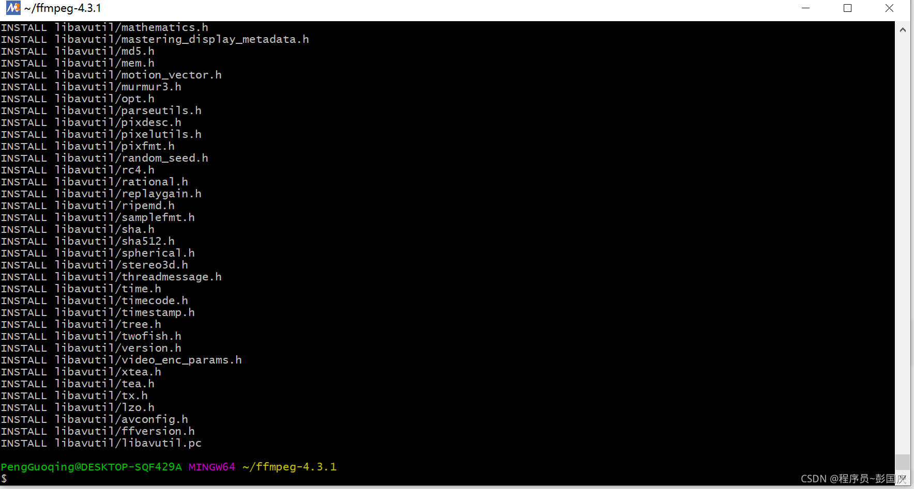
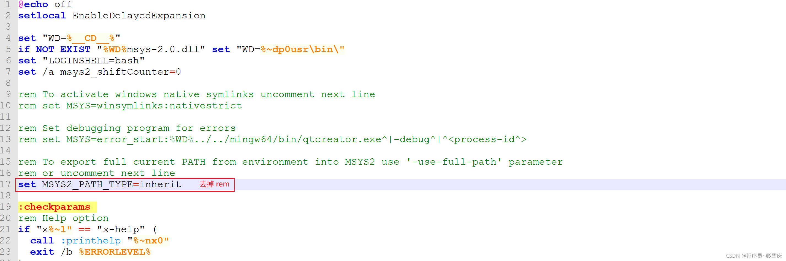
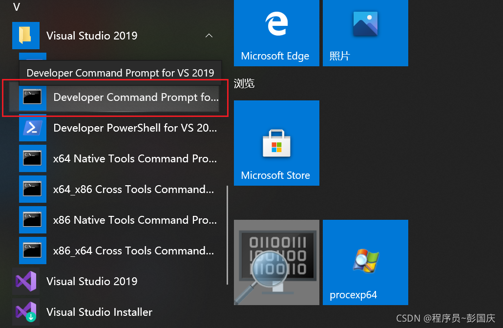
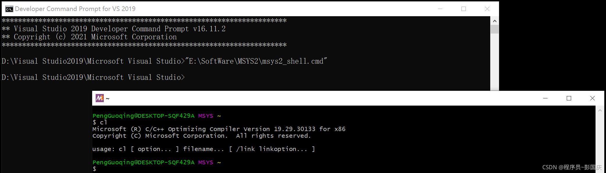
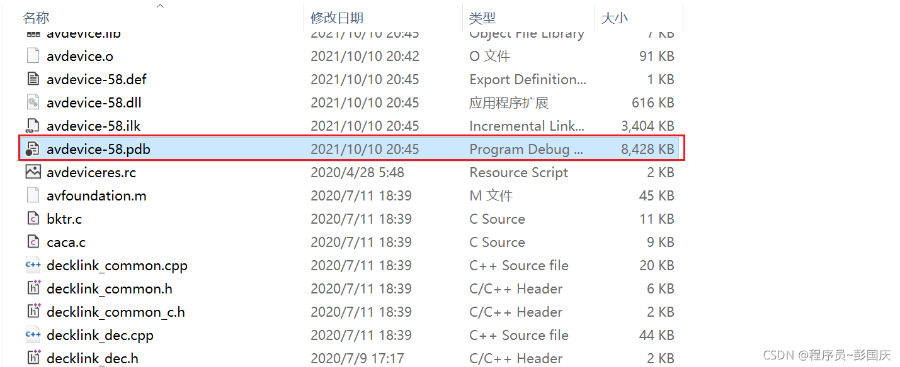
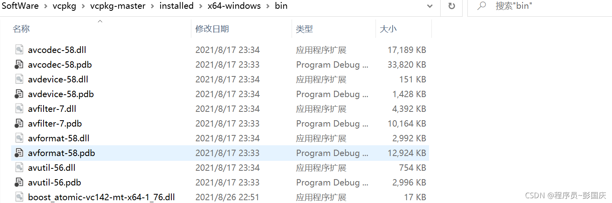

+++
title = "windows下编译ffmpeg的方式"
date = 2026-04-18
draft = false
categories = ["工程"]
tags = ["ffmpeg"]
+++


ffmpeg编译好的库可以直接通过官网下载，地址为 [http://ffmpeg.org/download.html#build-windows](http://ffmpeg.org/download.html#build-windows), 但是平时在调试相关的代码时总是希望通过单步调试进ffmpeg的接口函数看一下其内部的实现方式，通过官网直接下载编译好的库因为没有相关符号文件而无法实现这一愿望，所以只好自己编译啦，这里介绍两种常见的方式。ffmpeg的源码直接在 [github](https://github.com/FFmpeg/FFmpeg) 下载

# 1. 通过msys2安装
 首先需要安装msys2环境以及相关的编译依赖项, 官方网址为：
>[https://www.msys2.org](https://www.msys2.org) 

 在官网下载好 *.exe 后直接按照提示安装即可，安装好后需要将下载库的地址更换为国内源，否则下载速度可能会极慢，甚至失败。配置文件位于：
> MSYS2 \ etc \ pacman.d 中

分别将==mirrorlist.mingw32==、==mirrorlist.mingw64==、==mirrorlist.msys== 三个配置文件的第一个Server的地址更换为清华大学的镜像，这里贴出我修改好的==mirrorlist.mingw64==

```javascript
 	##
 	## 64-bit Mingw-w64 repository mirrorlist
 	##

 	## Primary
 	## msys2.org
	Server = https://mirrors.tuna.tsinghua.edu.cn/msys2/mingw/x86_64/
	Server = http://mirrors.ustc.edu.cn/msys2/mingw/x86_64/
	Server = https://sourceforge.net/projects/msys2/files/REPOS/MINGW/x86_64/
	Server = https://www2.futureware.at/~nickoe/msys2-mirror/mingw/x86_64/
	Server = https://mirror.yandex.ru/mirrors/msys2/mingw/x86_64/
	Server = http://mirror.bit.edu.cn/msys2/mingw/x86_64/
	Server = https://mirror.selfnet.de/msys2/mingw/x86_64/
	Server = https://mirrors.sjtug.sjtu.edu.cn/msys2/mingw/x86_64/
	Server = https://msys2.nyc3.digitaloceanspaces.com/mingw/x86_64/
	Server = https://mirror.jmu.edu/pub/msys2/mingw/x86_64/
	Server = https://ftp.cc.uoc.gr/mirrors/msys2/mingw/x86_64/
	Server = https://ftp.acc.umu.se/mirror/msys2.org/mingw/x86_64/
	Server = https://mirrors.piconets.webwerks.in/msys2-mirror/mingw/x86_64/
	Server = https://quantum-mirror.hu/mirrors/pub/msys2/mingw/x86_64/
	Server = https://mirrors.dotsrc.org/msys2/mingw/x86_64/ 
	Server = https://mirror.ufro.cl/msys2/mingw/x86_64/
	Server = https://mirror.clarkson.edu/msys2/mingw/x86_64/
	Server = https://ftp.nluug.nl/pub/os/windows/msys2/builds/mingw/x86_64/
	Server = https://download.nus.edu.sg/mirror/msys2/mingw/x86_64/
	Server = https://ftp.osuosl.org/pub/msys2/mingw/x86_64/
```
之后直接通过 ==pacman -Syu== 一键安装和升级所有的库。之后就可以编译ffmpeg啦 。

> 在编译过程中可能会遇到还缺少某些其他库的问题, 直接根据提示安装就可以。比如可能还需要安装的库如下：

```cpp
	pacman -S make 
	pacman -S yasm
	pacman -S pkg-config
	pacman -S mingw-w64-x86_64-gcc
	...
```
##  1.1 使用MinGW编译
 将下载好的ffmpeg解压到 msys2能访问到的目录下，比如 ==msys2 / home / username /== 中，执行
 

```cpp
//这里主要是指定安装目录是 msys2/usr/local/ffmpeg
	./configure --prefix=/usr/local/ffmpeg --enable-shared
```
等待配置好后再依次执行

```cpp
	make -j8
	make install
```
之后就编译成啦

  这种方式编译出来的ffmpeg适合在 Qt Creater 开发环境中使用
  
##  1.2 使用 MSVC 编译
  当我们在VS调试 ffmpeg 相关代码时就需要使用这种方式编译了。(需要PDB符号链接文件)
  ① 首先需要在 msys2 安装目录中找到脚本文件 ==msys2_shell.cmd==，然后按照如下方式修改

② 在windows开始菜单中找到VS2019点击 ==“开发人员命令提示行”== ，并在其中运行==msys2_shell.cmd==
   
此时在弹出的 msys2对话框中输入 ==cl==, 查看编译器是否为MSVC


同样的，进入到ffmpeg解码目录执行

```cpp
./configure --prefix=/usr/local/ffmpegmsvc --target-os=win64 --arch=x86_64 --enable-shared --toolchain=msvc --enable-gpl --enable-debug
```
等配置好后在使用 makefile 进行编译

```cpp
make -j8
make install
```
假如出现如下错误：
```cpp
fftools/opt_common.c(206): error C2065: “slib”: 未声明的标识符
fftools/opt_common.c(206): error C2296: “%”: 非法，左操作数包含“char [138]”类型
fftools/opt_common.c(206): error C2059: 语法错误:“数字上的错误后缀”
fftools/opt_common.c(206): error C2059: 语法错误:“%”
fftools/opt_common.c(206): error C2017: 非法的转义序列
fftools/opt_common.c(206): error C2015: 常量中的字符太多
fftools/opt_common.c(206): error C2001: 常量中有换行符
fftools/opt_common.c(237): error C2143: 语法错误: 缺少“)”(在“*”的前面)
fftools/opt_common.c(237): error C2143: 语法错误: 缺少“{”(在“*”的前面)
fftools/opt_common.c(237): error C2059: 语法错误:“)”
fftools/opt_common.c(238): error C2054: 在“options”之后应输入“(”
fftools/opt_common.c(278): error C2143: 语法错误: 缺少“)”(在“*”的前面)
fftools/opt_common.c(278): error C2143: 语法错误: 缺少“{”(在“*”的前面)
```
那么需要修改 fftools/opt_common.c 源码文件, 将第 206 行注释掉，原因是 CC_IDENT 标识未定义引起的, 如下所示：
```cpp
static void print_program_info(int flags, int level)
{
    const char *indent = flags & INDENT? "  " : "";

    av_log(NULL, level, "%s version " FFMPEG_VERSION, program_name);
    if (flags & SHOW_COPYRIGHT)
        av_log(NULL, level, " Copyright (c) %d-%d the FFmpeg developers",
               program_birth_year, CONFIG_THIS_YEAR);
    av_log(NULL, level, "\n");
    //av_log(NULL, level, "%sbuilt with %s\n", indent, CC_IDENT);

    av_log(NULL, level, "%sconfiguration: " FFMPEG_CONFIGURATION "\n", indent);
}
```


运行完就可以在指定的安装目录 ==/usr/local/ffmpegmsvc== 中看到编译好的库以及在源码位置对应的 PDB文件啦



# 2. 通过vcpkg安装（推荐）
vcpkg是微软提供的 C/C++ 库管理工具，音视频开发中常用的库几乎都已经支持了，比如ffmpeg、X264、X265、librtmp等，目前还在不断的新增中。
## 2.1 安装vcpkg
直接从github上下载 Release 版本并按照文档安装即可
>[https://github.com/microsoft/vcpkg](https://github.com/microsoft/vcpkg)

```cpp
 //vcpkg安装过程中可能会遇到的问题
 ① 下载某些源码库失败; (可能是因为网络的原因, 目前还没找到 vcpkg 可以修改镜像地址的地方)
 	采用的解决方案：直接复制下载报错信息中的地址到 Google 下载，再拷贝到 /downloads 目录中，有些库的名称需要根据vcpkg中的信息进行修改

 ② boost库校验信息失败;
    如：Downloading https://raw.githubusercontent.com/boostorg/boost/boost-1.73.0/LICENSE_1_0.txt... Failed. Status: 6;"Couldn't resolve host name"
    采用的解决方案：直接该地址下载对应的LICENSE文件: https://github.com/microsoft/vcpkg/issues/13348)

 ③ 其他样式的错误;
   采用的解决方案： 将VS2019升级到最新
```
在此分享一个安装好 vcpkg 后如何使用它来安装 C/C++库的博客, 包括如何与VS2019集成等。
[https://blog.csdn.net/cjmqas/article/details/79282847](https://blog.csdn.net/cjmqas/article/details/79282847)
                ==在此向该博客作者表示真挚的感谢==
                
## 2.2 安装 ffmpeg
 动态库方式安装：
 

```cpp
.\vcpkg.exe install ffmpeg:x64-windows
```
或者以静态库的方式安装

```cpp
.\vcpkg.exe install ffmpeg:x64-windows-static
```
安装完成后就可以在 ==vcpkg\installed\x64-windows\bin== 中看到ffmpeg相关的库和PDB啦


